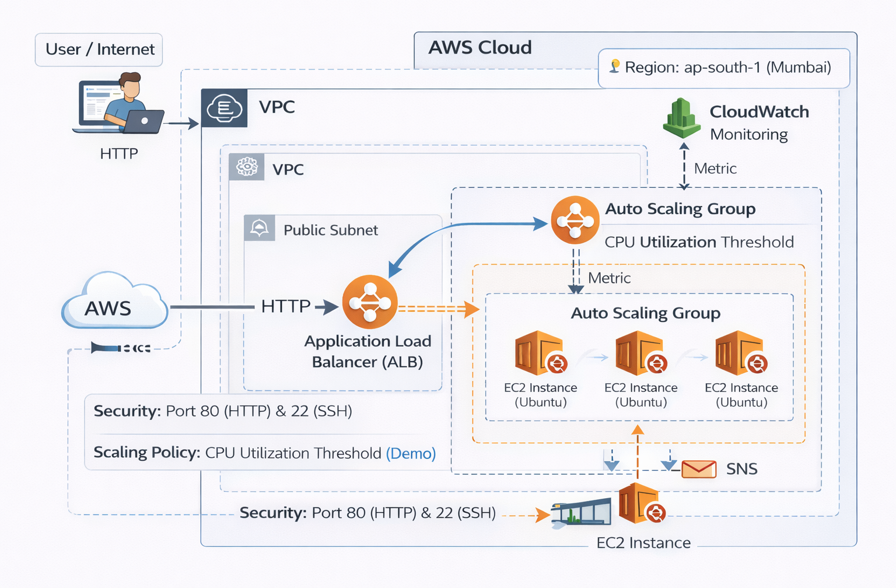
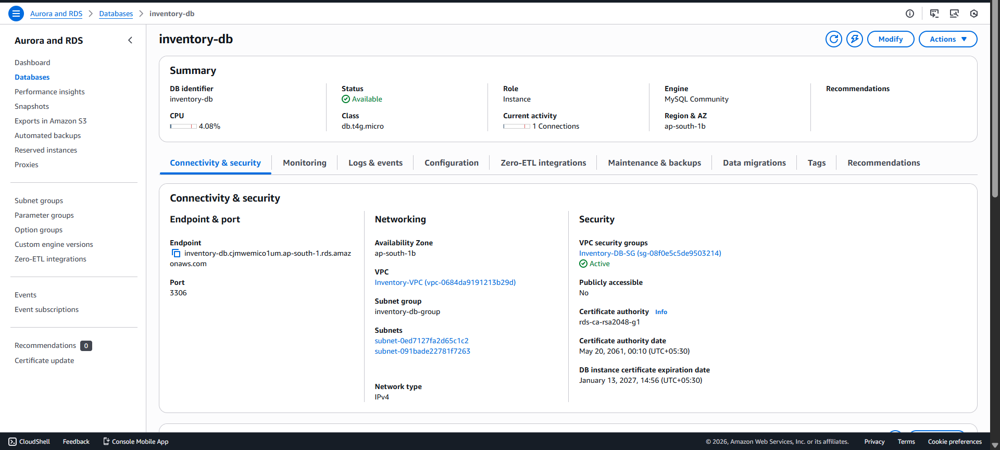
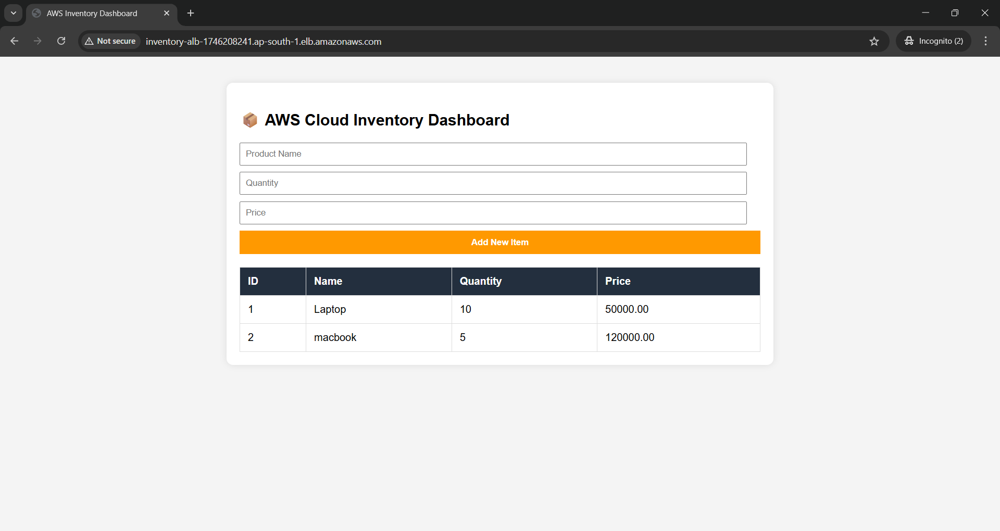

# Automated & Scalable Inventory Management System on AWS

A production-ready, highly available Inventory Management application built with **Python Flask** and architected on **AWS** using best practices for scalability, security, and automation.

## 🚀 Architecture Overview
This project demonstrates a 3-tier cloud architecture designed to handle traffic spikes and ensure zero downtime.

### Key Components:
- **Compute:** EC2 (Ubuntu) instances managed by an Auto Scaling Group (ASG).
- **Load Balancing:** Application Load Balancer (ALB) for intelligent traffic distribution.
- **Database:** Persistent MySQL database for inventory records.
- **Automation:** CloudWatch Alarms & Scaling Policies to scale fleet from **3 to 5 nodes**.
- **Monitoring:** SNS Notifications for real-time infrastructure alerts.

---

## 🛠️ Tech Stack
- **Cloud:** Amazon Web Services (AWS)
- **Backend:** Python (Flask)
- **Database:** MySQL
- **Networking:** VPC, Security Groups, Public/Private Subnets

---

## 🛠️ Project Evolution & Visual Proof

Here is the step-by-step implementation of the architecture, from a single server to a self-healing automated system.

### **Phase 1: Foundation & Design (Day 1)**
Building the blueprint and launching the core application.

| Description | Visual Proof |
| :--- | :--- |
| **Full Architecture Diagram** |  |
| **Initial EC2 Security** |  |
| **Python App Running** |  |
| **IP Dashboard** |  |

---

### **Phase 2: Data Logic & Security Hardening (Day 2)**
Ensuring data persistence and locking down the network.

| Description | Visual Proof |
| :--- | :--- |
| **MySQL Backend Table** |  |
| **Security Group Hardening** |  |
| **DB Compliance & Security** |  |

---

### **Phase 3: Automation & Scaling (Day 3)**
The "Climax" - Making the system think and react to traffic.

| Description | Visual Proof |
| :--- | :--- |
| **CloudWatch Alarm (Trigger)** |  |
| **Scaling Proof (5 Instances)** |  |
| **SNS Real-time Alert** |  |
| **DNS Dashboard** |  |

---

## 🏗️ Technical Implementation Details

### 1. Compute & High Availability
- **EC2 & ALB:** Deployed the application on Ubuntu instances behind an **Application Load Balancer** to distribute traffic across availability zones.
- **Auto Scaling Group (ASG):** Configured to maintain system health and handle traffic spikes dynamically.

### 2. Database & Security
- **Data Layer:** Integrated **MySQL** with **Flask-SQLAlchemy** for persistent record management.
- **Zero-Trust Security:** Restricted instance access to only the Load Balancer's security group, eliminating direct public exposure.

### 3. Monitoring & Alerting
- **CloudWatch:** Set up CPU-based alarms to trigger scaling policies.
- **Amazon SNS:** Automated email notifications for every scaling event, ensuring full visibility.

---

## 🔧 Implementation Steps

1. **Application Setup:** Developed a Flask app with MySQL integration for CRUD operations.
2. **Infrastructure:** Launched EC2 instances and configured a custom VPC with secure Security Groups.
3. **Availability:** Deployed an Application Load Balancer (ALB) to route traffic to Target Groups.
4. **Elasticity:** Created an Auto Scaling Group (ASG) with a dynamic scaling policy (CPU > 70%).
5. **Testing:** Performed a stress test to verify the auto-scaling trigger and SNS alert system.

---

## 🛡️ Security Best Practices
- Implemented **Security Group Hardening** (Web instances only accept traffic from the ALB).
- Database layer isolated with restricted access rules.
- Environment variables used for sensitive credentials.
